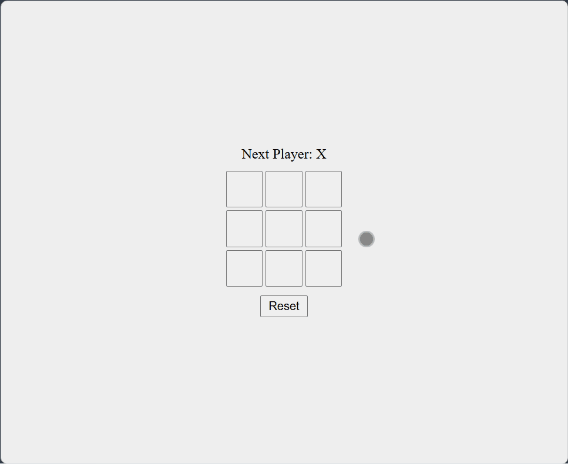

# Tic Tac Toe

An interactive **Tic Tac Toe** game built with **React + Vite + TypeScript**.
This project demonstrates clean component-based architecture, responsive UI, and modern tooling for front-end development.

---

## 🚀 Live Demo

[View Project](https://himanshu-kumar-2301.github.io/fcc-tic-tac-toe/)

---

## 🛠️ Tech Stack

- **React 19** - UI components
- **TypeScript** - type safety
- **Vite** - build tool & dev server
- **ESLint** - linting & code quality

---

## 📸 Preview



---

## 📚 Features

- **Classic Tic Tac Toe gameplay**: two players take turns.
- **Win detection logic**: highlights winning combinations.
- **Draw detection**: handles stalemate scenarios.
- **Responsive design**: works across desktop and mobile.
- **TypeScript support**: ensures type safety and maintainability.
- **Fast development with Vite**: optimized build and hot-reload.

---

## 📂 Project Structure

```code
root/
|--public/
|--src/
|  |--styles.css
|  |--main.tsx
|  |--components/
|  |  |--Square.tsx
|  |  └──Board.tsx
|  └──assets/
|     └──screenshot.gif
|--index.html
|--package.json
|--vite.config.ts
|--tsconfig.json
|--README.md
```

---

## ⚡ Getting Started

1. Clone the repo:

    ```bash
    git clone https://github.com/Himanshu-Kumar-2301/fcc-tic-tac-toe.git
    ```

2. Navigate into the folder

    ```bash
    cd fcc-tic-tac-toe
    ```

3. Install dependencies

    ```bash
    npm install
    ```

4. Start the dev server

    ```bash
    npm run dev
    ```

---

## 📌 Future Improvements

- Add AI opponent mode.
- Track scoreboard across multiple rounds.
- Enhance UI with animations and themes.

---
